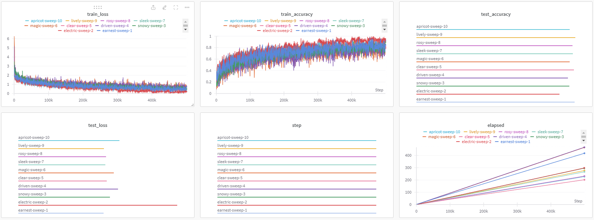

# Custom Adam Optimizer and ResNet34 Implementation with Hyperparameter Tuning

## Overview
This is my implementation of a custom Adam optimizer and a ResNet for image classification using the CIFAR-10 dataset. The custom Adam optimizer is like the PyTorch version, but assumes `amsgrad=False` and `maximize=False`. I also used Weights and Biases (wandb) for hyperparameter tuning through sweeps. The sweep configuration is defined in the `sweep_config.yaml` file. The sweep explores different values of learning rate (`lr`) and batch size (`batch_size`) to find the best performing model.

## Results

The results of the hyperparameter sweep, including the best hyperparameters and the accuracy graph, can be found [here](https://api.wandb.ai/links/azrilhafizi/s1y5i0ln).

## Running the Project
1. Clone the repository:
```bash
git clone https://github.com/azrilhafizi/custom-adam-resnet.git
cd custom-adam-resnet
```

2. Install the required dependencies:
```bash
pip install torch torchvision tqdm wandb pyyaml
```

3. Ensure you have your Weights and Biases account set up. If you don't have one, you can sign up at [wandb.ai](https://wandb.ai/).

4. Run the main script to start the hyperparameter sweep:
```bash
python main.py
```